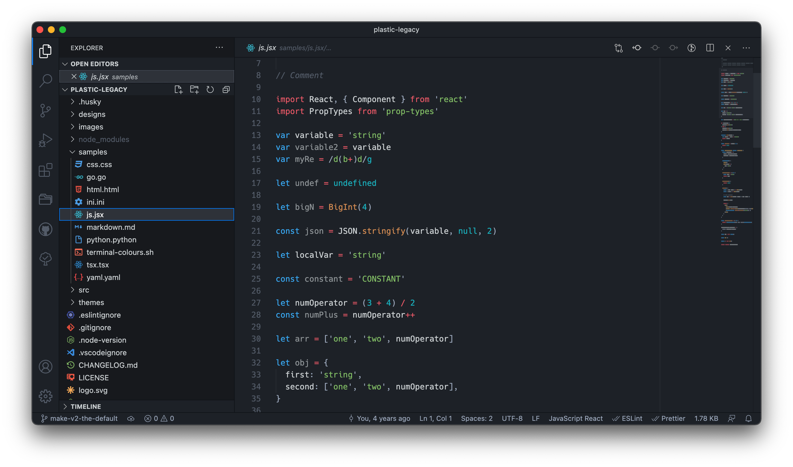

# Plastic Legacy

A simple syntax and UI theme for Visual Studio Code, derived from the second
version of [Will Stone](https://wstone.uk)'s
[Plastic Theme](https://plastic.wstone.uk/).

## Notable features

- Dark UI elements for all-day coding.
- Small colour palette to avoid visual overload.
- Additional deprioritised-punctuation theme; concentrate on the content.

## License

MIT

## Development

The themes are created using a generator: `src/index.ts`. The configuration can
be found in the `src/theme.ts` files.
